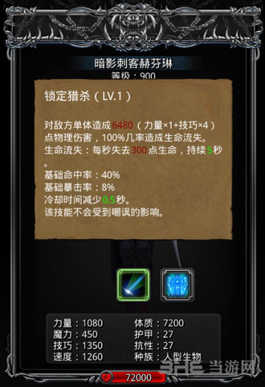
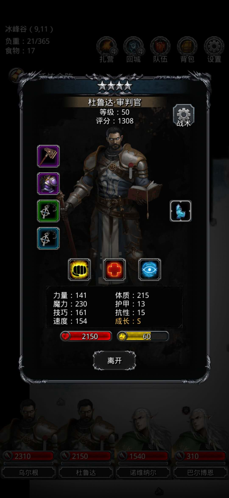
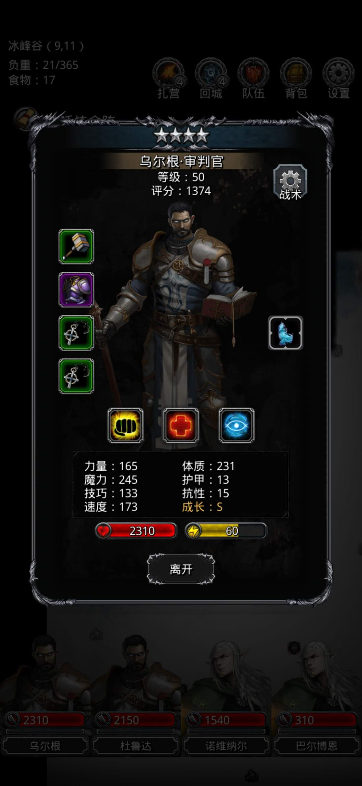
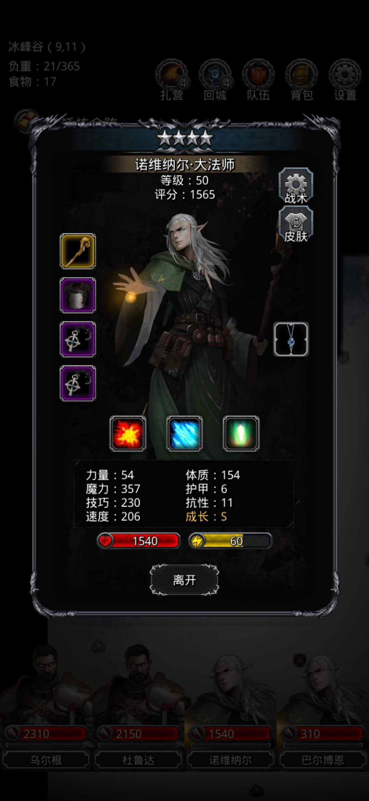
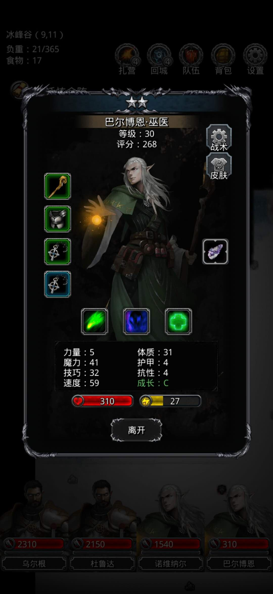
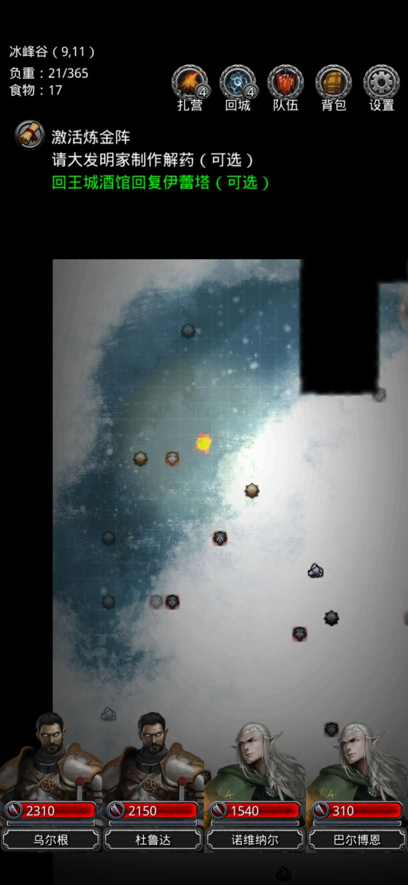
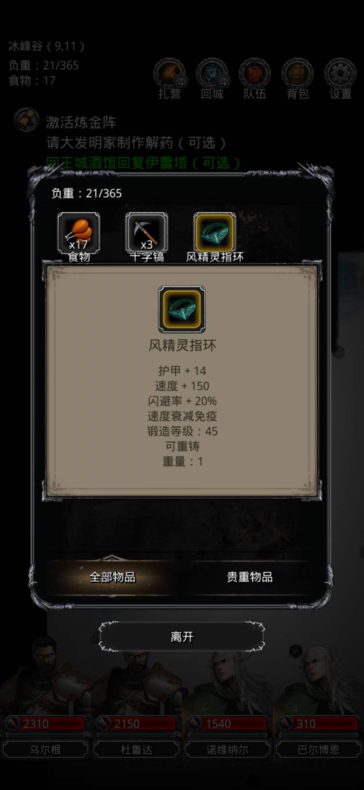

# 背景

# 解决方案

## 方法：重伤法

## 阵容：骑骑法巫

- 审判官，4星50级，力速比<1，奶量>310,技能1%奶队友其他全关闭（奶量充足，且可以负重）

- 审判官，4星50级，力速比<1，奶量>310,技能1%奶队友其他全关闭（奶量充足，且可以负重）

- 大法师，4星50级，力速比<0.25，奶量>310,技能1%奶队友其他全关闭（力速比低解决流血问题，且可以负重）

- 巫医，2星30级，血量310（体质31），抗性<5（否则无法触发boss流血效果导致其他问题），力速比<0.25,技能3开s其他全关（力速比低,可以打出伤害）

# 参考资料
>  [重伤法果然名不虚传，过了图12暗影刺客](http://bbs.9game.cn/thread-28677294-1-1.html) 
> [地下城堡2超低配重伤法过暗影刺客](https://www.bilibili.com/video/av57363238/?redirectFrom=h5)