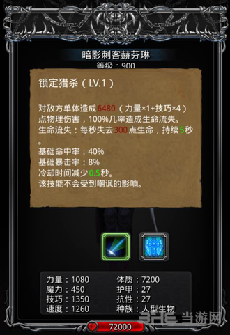
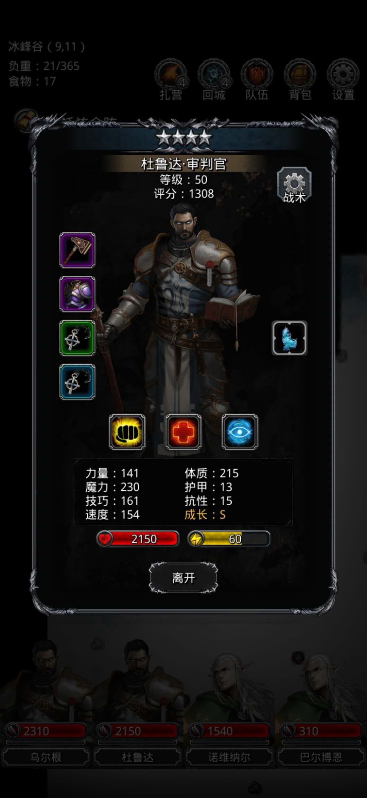
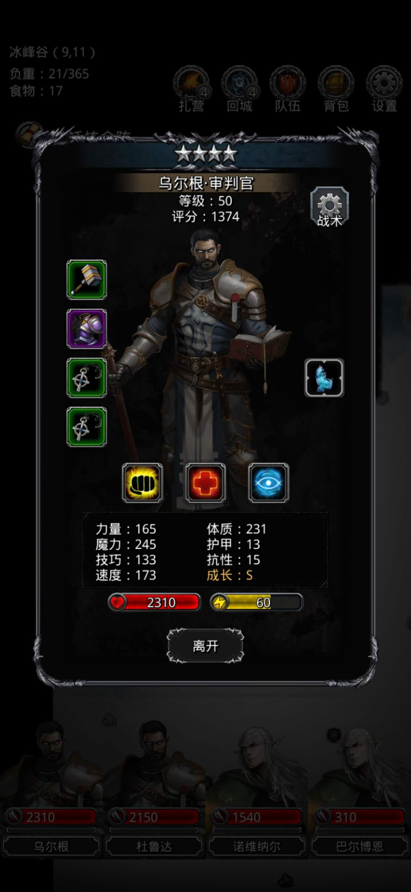
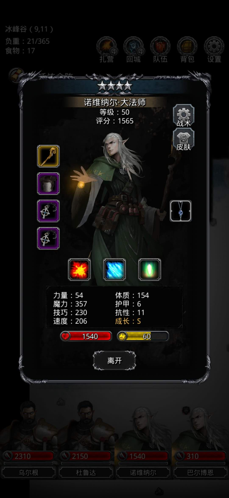
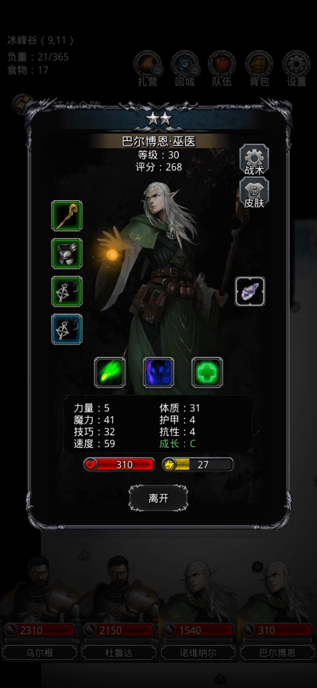
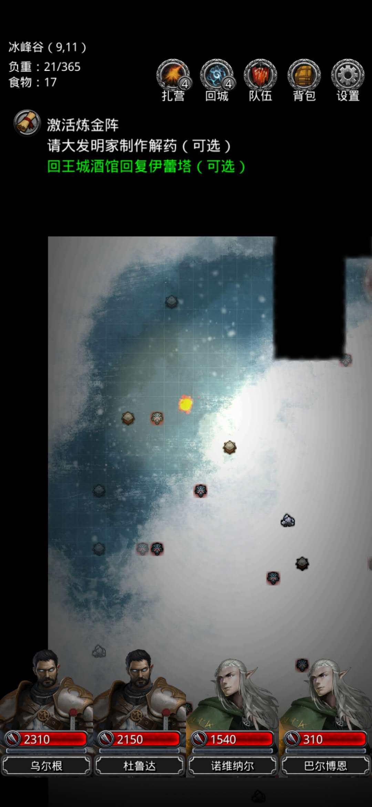
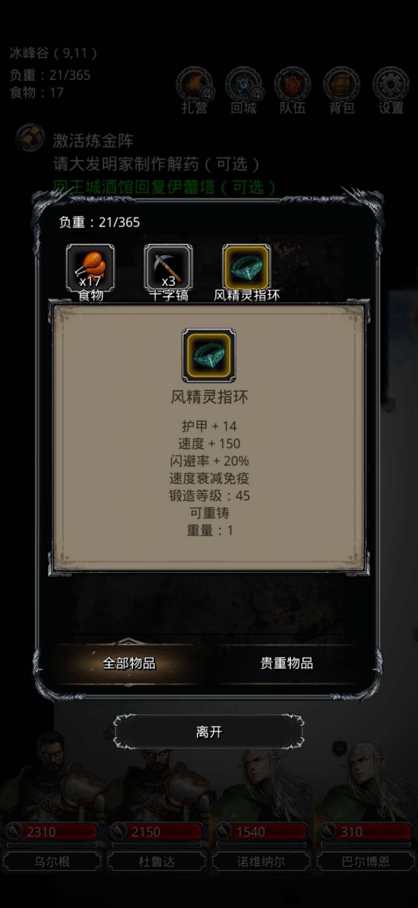

# 背景

# 解决方案

## 方法：重伤法

## 阵容：骑骑法巫

- 审判官 ×2，4 星 50 级，力速比 < 1，奶量 > 310，技能 1% 奶队友，其他全关闭（奶量充足，且可以负重）。
- 大法师，4 星 50 级，力速比 < 0.25，奶量 > 310，技能 1% 奶队友，其他全关闭（力速比低解决流血问题，且可以负重）。
- 巫医，2 星 30 级，血量 310（体质 31），抗性 < 5（否则无法触发 boss 流血效果，导致其他问题），力速比 < 0.25，技能 3 开 s，其他全关（力速比低，可以打出伤害）。

# 参考资料

> [重伤法果然名不虚传，过了图12暗影刺客](http://bbs.9game.cn/thread-28677294-1-1.html)
>
> [地下城堡2超低配重伤法过暗影刺客](https://www.bilibili.com/video/av57363238/?redirectFrom=h5)
