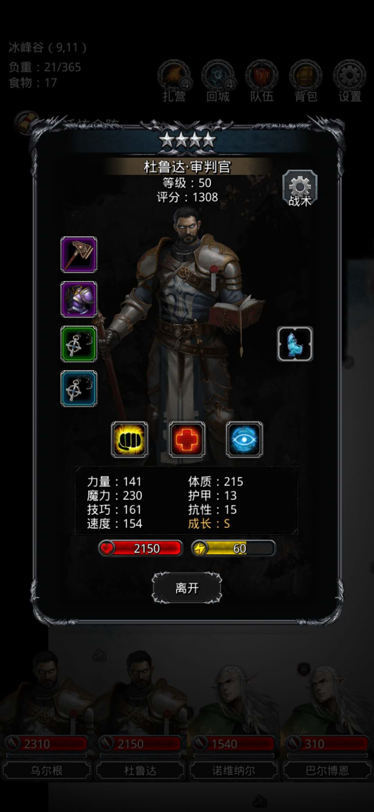
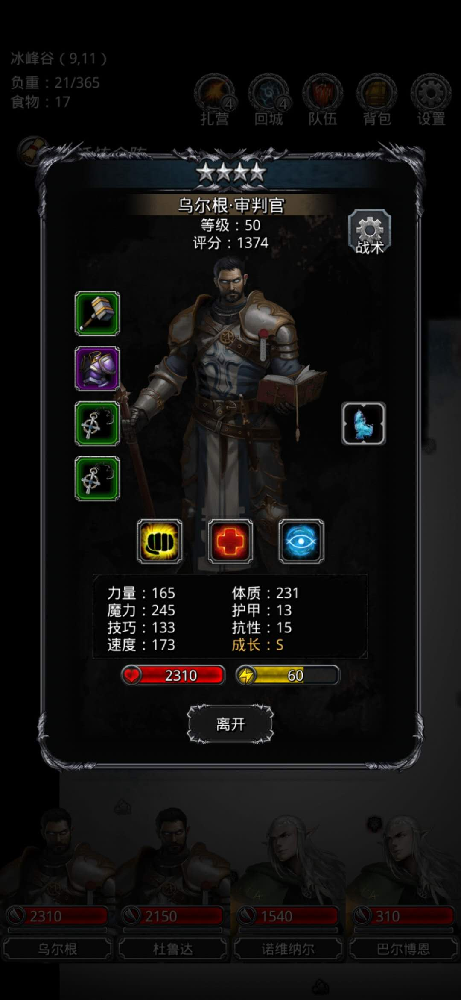
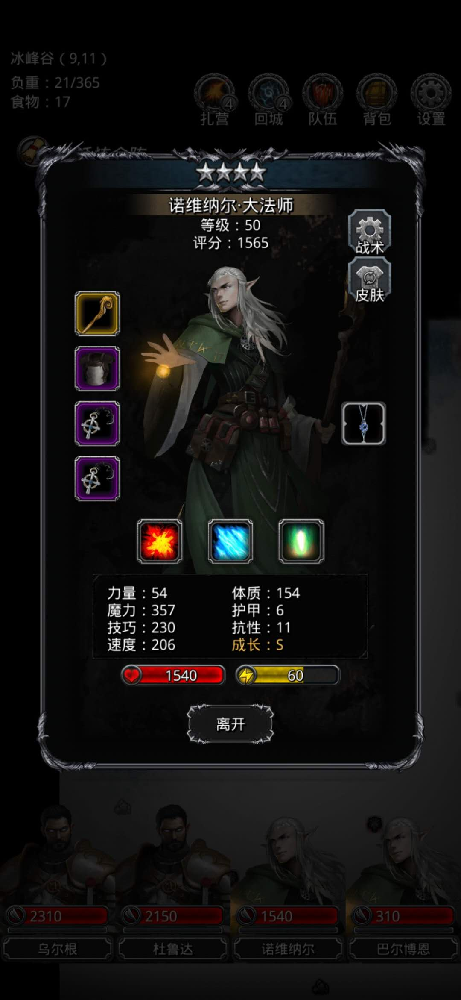
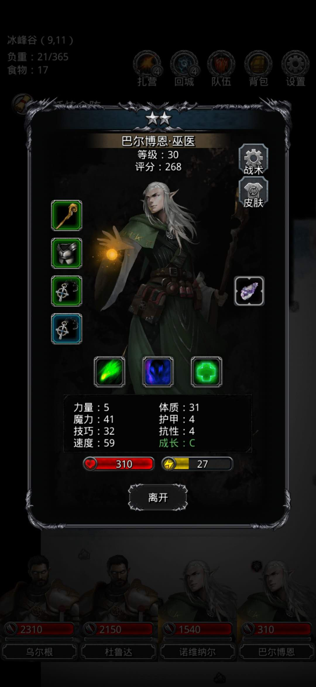
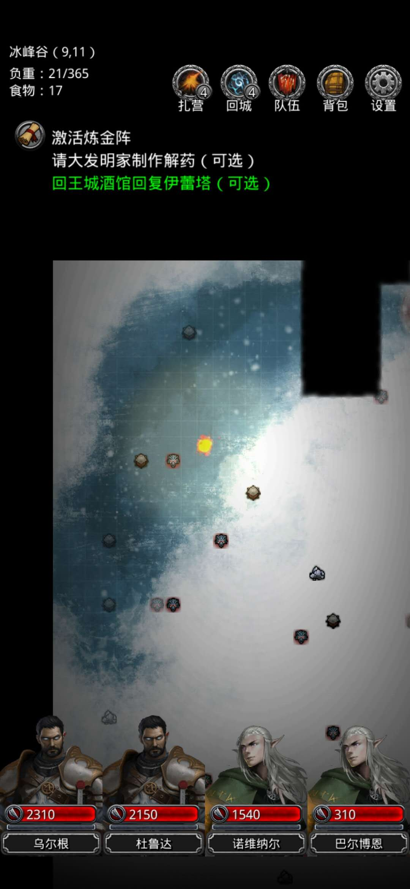
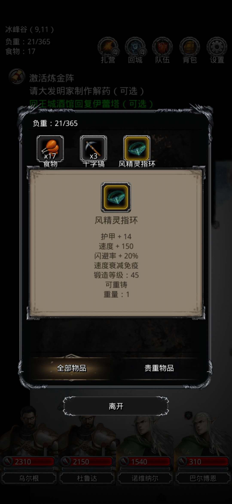

💡 重伤法的反直觉在于：故意养一个最弱的角色送死，反而能打过比自己强得多的BOSS。把BOSS的致命机制从威胁变成工具，是策略游戏的深层逻辑。

## 背景

地下城堡2图12的赫芬琳卡了我三天。她的锁定猎杀技能伤害高到离谱，我当时的阵容奶量根本扛不住。

正常思路是堆装备、升星级、硬刚，但低配玩家没这个条件。

后来在论坛看到有人用"重伤法"过关，思路完全反着来。不是想办法让角色不死，而是故意让一个角色死掉再复活，用复活的无敌时间卡BOSS的攻击节奏。试了一下午终于过了，这里把思路和配置整理出来。

## 赫芬琳为什么难

她的三个机制叠在一起，低配几乎无解：

- 锁定猎杀：随机盯一个人往死里打，伤害秒杀级
- 流血效果：持续掉血，奶量跟不上就团灭
- 血量阈值：低于一定比例狂暴，输出更高

正常打法要求奶量大于BOSS爆发伤害，但低配玩家的奶量天花板就在那。硬堆数值这条路走不通，得换思路。

## 重伤法的核心思路

这个打法的精髓是：把BOSS的"锁定猎杀"从威胁变成工具。

BOSS会锁定一个角色集中攻击，这个机制本身是设计来制造压力的。但如果你故意喂给它一个容易死的目标，它就会一直盯着这个目标打。

目标死了复活，复活又被秒，循环往复。BOSS的攻击节奏就被你控制住了。

本质上是用巫医的血量当一个"计时器"。巫医活着的时候BOSS在打他，其他人安全输出。巫医死了到复活的间隙，无敌时间内继续输出。BOSS永远在打一个"会复活的人"，没有余力去杀你真正的主力。

这在格斗游戏里叫"frame trap"——用可控的牺牲换取节奏控制权。你主动放弃一个回合的主动权，换取对手的节奏被打乱，从而在后续回合获得更大的优势。

## 受控牺牲：一个通用策略模式

重伤法不只是地下城堡2的特例。"受控牺牲"是一个在很多策略游戏中都适用的通用模式。

核心逻辑：当对手的AI行为可预测时（比如锁定最低血量目标、优先攻击最近单位），你可以故意制造一个"诱饵"来引导对手的行为，从而控制战斗节奏。

国际象棋里也有类似概念——"弃子"（gambit）。主动牺牲一个棋子，换取位置优势或节奏控制。低级别的玩家觉得弃子是"亏了"，高级别的玩家知道牺牲本身是策略的一部分。

这类策略的共同前提是：你必须理解对手的决策逻辑。在BOSS战中，"对手"是AI targeting逻辑。在棋类中，"对手"是人类的心理模式。不管哪种，关键都是：把对手的规则变成你的工具。

## 阵容配置

### 审判官 ×2（4星50级）

两个审判官负责奶和复活。配置要点：

- 力速比小于1，确保奶量跟得上
- 奶量大于310，刚好覆盖巫医血量
- 技能只开1%奶队友，其他全关
- 职责就是持续奶巫医加复活

### 大法师（4星50级）

大法师负责高速奶和解流血：

- 力速比小于0.25，出手要极快
- 奶量大于310
- 技能只开1%奶队友
- 主要解决流血效果

### 巫医（2星30级就行）

巫医是这套阵容的灵魂，也是最反直觉的地方：

- 血量310（体质31）
- 抗性低于5（关键，后面解释）
- 力速比小于0.25
- 技能只开3技能
- 职责：送死，复活，输出，再送死

## 两个容易踩坑的细节

### 巫医为什么要2星30级

这是整套打法最反直觉的地方。正常游戏逻辑是角色越强越好，但这里恰恰相反。

低星级巫医血量低、抗性低，正好满足"被秒杀"和"触发流血"两个条件。如果你用高星级巫医，血太多死不了，循环直接断掉。抗性太高的话BOSS流血打不出来，整个机制又断了。

所以这里不是"凑合用低配"，而是"必须用低配"。游戏里很少见这种设计，角色弱反而是优势。

### 抗性为什么必须低于5

BOSS的流血效果有触发条件：目标抗性足够低。巫医抗性高于5的话，BOSS流血打不出来，重伤法的循环就断了。

降抗性靠风精灵戒指。这是整套阵容唯一需要的关键装备，其他都可以用低配替代。

## 这个打法的代价

重伤法不是没有代价。你牺牲了一个输出位给巫医当诱饵，整体DPS比正常阵容低。这意味着战斗时间长，对奶量的持久性要求高。

如果审判官的奶量撑不住漫长的战斗，还是会崩。另外这套阵容对操作节奏有要求——复活时机、技能开关比例都得调对，差一点就循环不上。

我第一次试的时候技能比例没调好，巫医复活了但奶跟不上，又灭了两次。调试的过程本身也是一种成本，不是配好了就一定能过。

## ✅ 总结

- 重伤法的核心是反逻辑：用最弱的角色当诱饵，把BOSS的锁定攻击从威胁变成可控的节奏工具
- "受控牺牲"是通用策略模式——当你理解对手的决策逻辑时，可以把对手的规则变成你的工具
- 巫医2星30级就行，关键装备是降抗性的风精灵戒指，4星50级审判官加大法师就能过
- 代价是DPS低、战斗时间长、调试成本高——没有免费的策略，只有不同的取舍
